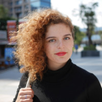

ROAM is the research on animal movement group at James Cook University. Our group is made of a diverse group of people across several disciplines, academic qualifications, gender, cultural backgrounds and expertises. We interested in a wide variety of matters associated to movement of animals in a manifold of ecosystems and taxa, including crustaceans, fish, birds, mammals and reptiles.

ROAM was funded and is currently lead by Kyana Pike and Emily Webster, with the invigorating collaboration of ROAM members.  

<table border="0">
  <tr>
    <td width="200"> </td>
    <td width="300">
        <b style="color:#4a4e69;font-size:25px;">Kyana Pike</b>
        
Kyana is a PhD candidate studying the effect of agriculture practices and infrastructure on the movement of giant tortoises in the Galapagos archipelago.

    </td>
   </tr> 
   <tr>
      <td width="200"></td>
      <td width="300">
        <b style="color:#4a4e69;font-size:25px;">Emily Webster</b>
        
Emily is a PhD candidate researching the drivers of habitat use from green turtles in Queensland, Australia.

      </td>
  </tr>
</table>